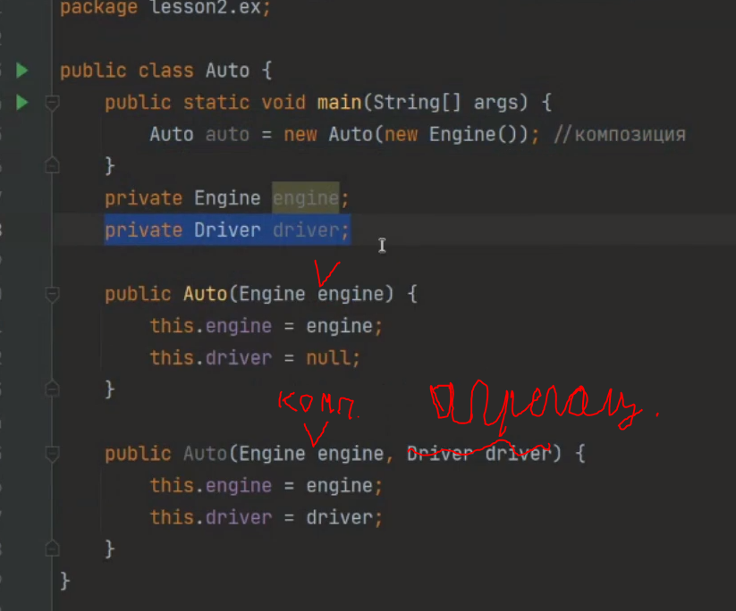

# ДЗ 3 Вопросы
 Отсутсвуют
--
--
--
--
--
--
--
--
--
--
--
--
--
--

# ДЗ 3

1. Добавить интерфейс Copmparable<Medicine> к классу Medicine. Переопределить метод compareTo()

2. Создать несколько экземпляров Medicine(лекарство), добавить их в ArrayList, написать метод, выводящий Medicine в отсортированном виде.

3. *(усложненное, не обязательное) Постараться написать еще 1 метод сортировки лекарств, но уже по другому параметру(сделано в классе через лямбда-функцию)
Формат сдачи: ссылка на гит

# ДЗ 2 Вопросы
Небольшое чувство, что я перемудрил со сложностью класса клиники, 
но хранить в ней List с экземплярами докторов и медсестёр 
казалось самым логичным.

Не придумал как можно было бы избавится от схожих методов в клинике, 
не уверен нужна ли была дубликация методов Fire\Hire для Nurse и Doctor в 
отдельности, логичнее бы было сделать это абстрактным классом(и под него же 
вписать лечение и выписку) и потом написать их определения отдельно в классах,
но тогда ломалась концепция работы именно с List'ами классов, т.к. они есть только 
в клинике.

Была мысль добавить метод, который приписывал бы медсестру к врачу, чтобы оправдать
агрегацию, но решил что уже будет перебор, т.к. в выводе слишком много всего.

Больше вопросов нет.

# ДЗ 2

public class VetClinic {

// Список больных, список персонала(состояния)

// Поведение - нанять работника, уволить работника, принять на лечение, выписать

// Получить всех бегающих\плавающих\летающих

Связать - включить поле Nurse как композицию или агрегацию в Doctor.

}

Классы Doctor, Nurse с состояниями и поведением.

Интерфейсы Goable, Flyable, Swimable с методами dobule, со скоростью заданного действия.

Добавить наследников интерфейсам (у каждого хотя бы по 2)

# ДЗ 1

На мой взгляд проблема в том, что необходимо переопределять 
методы действий, которые не может выполнять животное для 
каждого класса отдельно. Соответственно при добавлении каждого нового вида животных 
нужно постоянно прописывать одно и то же.

Правильнее, наверное, было бы сделать отдельные подклассы,
наследующие от Animal(водоплавающие, летающие и т.д., 
а затем уже от них наследовать непосредственных животных), тогда 
мы бы просто переопределили методы только в 3-4 местах.

Альтернативно - создать отдельные поля в классе Animals(canswim, canwalk, canfly),
которые будут работать как флаг и прописать условия для них в исходных методах 
в классе Animal.

Последнее, скорее всего, самое правильно решение, но насколько понял из объяснений 
семинара нужно сделать как раз неэффективно.

# Справка

**Абстрактный класс** - это класс, который может иметь, а может и не иметь 1 
или более абстрактных методов

Единственный случай, когда мы можем не реализовывать абстрактный метод в 
классе-наследнике - это когда сам наследник тоже абстрактный

**Поля** описывают **Состояние**, а **Методы** описывают **Поведение**

У **абстрактного класса** может описывать состояния и поведение, в то время как  
**интерфейс** описывает только поведение

У **функционального интерфейса** есть только 1 неопределенный метод.

*Swimable dolp= new Dolphin("Dolp",80,LocalDate.now(),new Owner());*

При создании объекта важно помнить к чему его нужно отнести, т.к. например 
метод dolp.sound() не работал бы, если создать dolp как Animal, 
поскольку в абстрактном классе отсутствует данный метод.

**Абстрактный класс** используем в тех случаях, когда у нас 100% возможных 
объектов обладают определенными в нём методами, а **Интерфейс** используем 
в случая когда необходимо разделение (flyable - удобнее создать интерфейс, 
т.к. не все животные летают, eatable - удобнее сделать просто метод в 
абстрактном классе, т.к. все животные питаются)]

**Маркировочный интерфейс** - пустой интерфейс, который используем, 
для того чтобы объединять разнородные классы через implements, например, 
для того чтобы засунуть объекты из разных классов в один список.

**Агрегация** - когда объект может существовать без объекта, но всё равно с ним связан
**Композиция** - когда мы не можем создать один объект без другого(например машину без двигателя)

Основной принцип - больше Агрегаций, меньше Композиций

# Оформление кода

*Верблюжья нотация(camelCase) - когда название состоит из нескольких слов, написанных слитно,
но каждое новое слово пишется с большой буквы.

Все названия должны четко отражать суть создаваемого объекта/метода/переменной или поля класса

По международной договоренности весь код пишется на английском языке

Практически всегда новый объект - новый файл.

1. Все ключевые слова и операторы (instanceof, this, super, if, else), а также примитивные типы данных пишутся
с маленькой буквы в верблюжьей (camelCase) нотации;

2. Все ссылочные типы данных (String, StringBuilder, List, Map) пишутся с большой буквы
в верблюжьей (camelCase) нотации;

3. Классы, записи (record) в java - существительное с большой буквы в ед.ч. Animal
в верблюжьей (camelCase) нотации;

4. Интерфейсы в java - c большой буквы, название отражает совокупность действий, поддерживаемых интерфейсом,
например, List - поддерживает методы списков в java. Часто к названию интерфейса добавляют суффикс "able" -
Serializable (способный к сериализации) в верблюжьей (camelCase) нотации;

5. Перечисления - то, что перечисляется с большой буквы во множ.ч Commands, Days, DaysOfWeek...
в верблюжьей (camelCase) нотации;

6. Названия методов начинаются с глагола, с маленькой буквы в верблюжьей (camelCase) нотации:
getAnimals(), calculateSumOfMoney();

7. Названия переменных - часто существительные с маленькой буквы в верблюжьей (camelCase) нотации: sumOfMoney

8. Названия пакетов(папок) в приложении состоят из 1 слова с маленькой буквы: controller, controllers
и должны отражать то, какую логику выполняют хранящиеся в пакете классы. Если для такого описания невозможно
подобрать 1 ёмкое слово, тогда нужно в один пакет вложить второй, третий... Например, interfaces, classes - ПЛОХИЕ
названия для пакетов, controllers, services - намного лучше

9. Нет четко правильных и неправильных названий, способность хорошо именовать части программы приходит с опытом.